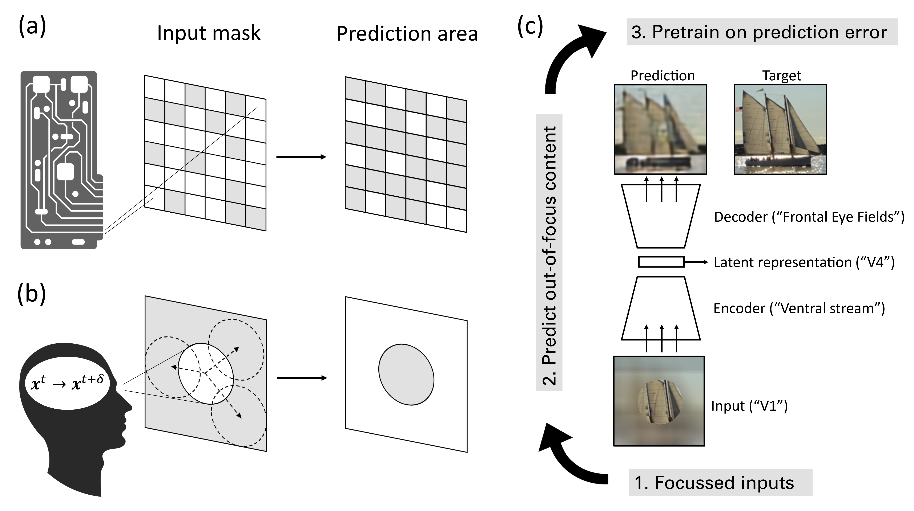
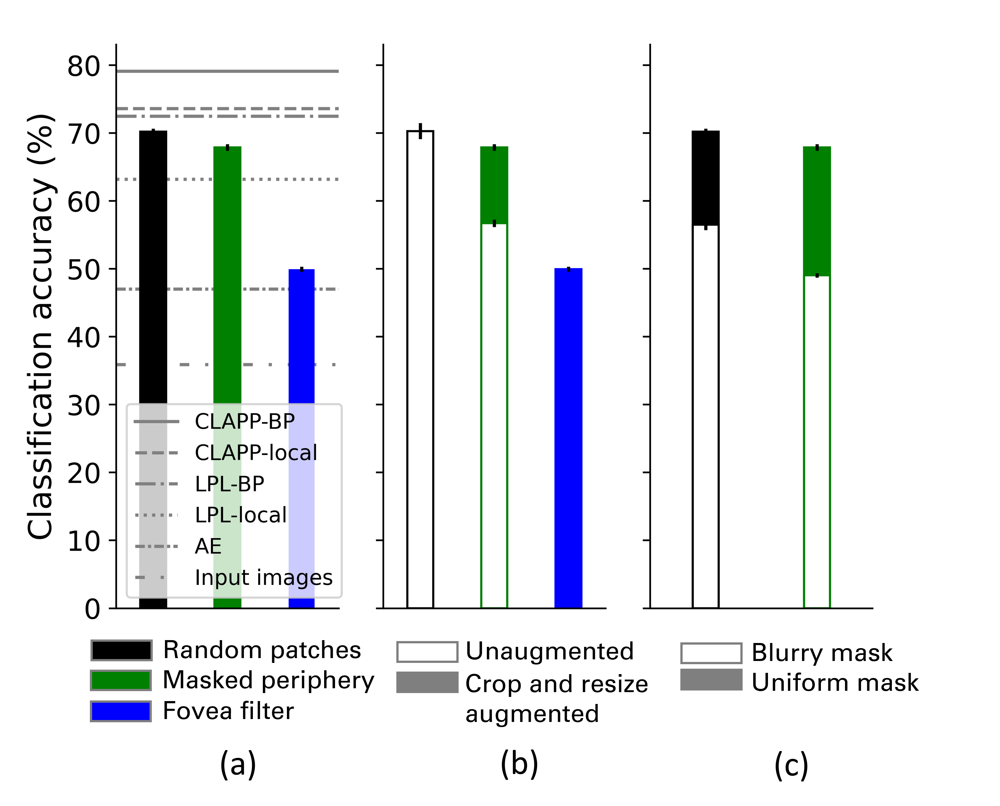

# Masked Image Modeling as a Framework for Self-Supervised Learning across Eye Movement

This repository is the official implementation of Masked Image Modeling as a Framework for Self-Supervised Learning across Eye Movement (https://arxiv.org/abs/...). 

We investigate Masked Image Modeling in convolutional networks from a biological perspective. As shown in panel (b) of the figure below, the focused nature of primate perception offers a natural masking paradigm in which peripheral and inattended parts are less accessible. Predicting this masked content and revealing it via eye movements then creates a self-supervised task that, as we show, leads to learning of object representations.


<p align="center"> 
    
</p>


## Requirements

Create an environment with Python 3.9 and activate.

To install requirements:

```setup
pip install -r requirements.txt
```


## Pretraining and linear probing

To train and evaluate the model(s) in the paper on the STL10 dataset, run this command:

```
python pretrain_and_evaluate.py --input-path <path_to_data> --output-path <path_to_results>  --masking-mode <"random_patches"/"foveate"/"periphery"/"None"> --masking-ratio <0-1> --blur <"True"/"False"> --random-crop <"True"/"False"> --learning-rate <0.0001-0.0005> --epochs <500> --seed <0/1/2/3/4>
```

We found a learning rate of 1e-3 to work best for the masked-periphery models, while 5e-3 was best for all other models. Furthermore, we found a masking ratio of 0.8 and 0.6 to work best for masked-periphery models and masked-random-patches models, respectively.

## Presegmentation

To restrict the reconstruction loss to the main object:

Step 1: Obtain segmentation masks from the STL10 dataset via the *remb* library, by running `data/segment_images.ipynb`. This is not parallelized and thus very slow.

Step 2: To restart pretraining using the obtained segmentations, run

```
python pretrain_and_evaluate.py --input-path <path_to_data> --output-path <path_to_results>  --masking-mode <"random_patches"/"foveate"/"periphery"/"None"> --masking-ratio <0-1> --blur <"True"/"False"> --random-crop <"True"/"False"> --learning-rate <0.0001-0.0005> --epochs <500> --seed <0/1/2/3/4> --segment_path <"data/STL10_segmentations"> --remove-missing-segments <"False">

```

Step 3 (optional): In `data/segment_images.ipynb`, one can use a heuristic to filter insufficient segmentation masks (discarding masks where less than 100 pixels (out of 96x96) received a confidence score of 0.8 (out of 1) or higher). Then, one can use the remaining segmentation masks and remove images corresponding to the removed masks using 

```
python pretrain_and_evaluate.py --input-path <path_to_data> --output-path <path_to_results>  --masking-mode <"random_patches"/"foveate"/"periphery"/"None"> --masking-ratio <0-1> --blur <"True"/"False"> --random-crop <"True"/"False"> --learning-rate <0.0001-0.0005> --epochs <500> --seed <0/1/2/3/4> --segment_path <"data/STL10_segmentations-filtered"> --remove-missing-segments <"True">

```


## Results

Across the various masking conditions, the models achieve the following performance on the STL10 dataset:

<p align="center"> 
    
</p>


